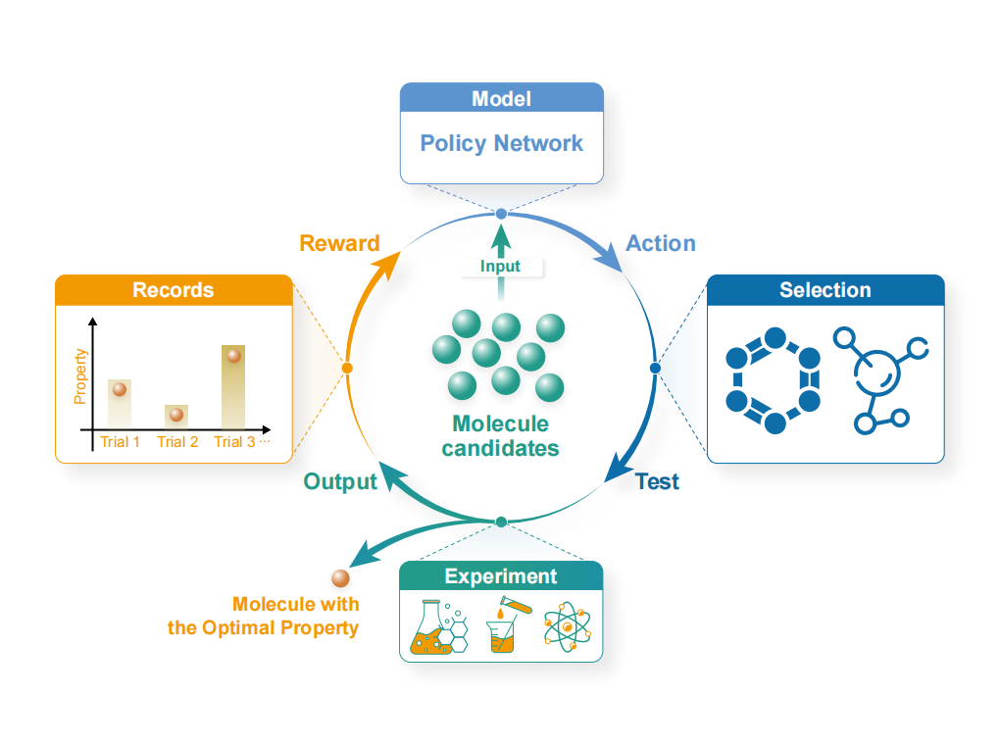

# <a name="Framework"></a> Policy-Based Active Learning Framework for Efficient Molecular Identification

[](https://github.com/To-phoenix-zhw/MolecularIdentification-Framework/blob/main/LICENSE)

Official PyTorch implementation of paper "Policy-Based Active Learning Framework for Efficient Molecular Identification". 

<div align=center>
    
</div>


[Contents](#Framework)

- [1. Installation guide](#installation)
- [2. Run the framework with a single command](#example)
- [3. Reproduce the results](#more)
  - [3.1 Datasets](#datasets)
  - [3.2 Training](#training)
  - [3.3 Testing](#testing)
- [4. Running on your own data](#custom)
- [5. Contact](#contact)


## <a name="installation"></a>1. Installation guide

### Dependency

The code has been implemented in the following environment:

| Package        | Version  |
| -------------- | -------- |
| Python         | 3.7      |
| PyTorch        | 1.8.0    |
| CUDA           | 11.1     |
| RDKit          | 2022.9.1 |
| DeepChem       | 2.7.1    |
| py-xgboost-gpu | 1.5.1    |

The code should work with Python >= 3.7. You could change the package version according to your needs.


### Install via Conda and Pip

```shell
conda create -n Identification python=3.7
conda activate Identification

pip install torch==1.8.0+cu111 torchvision==0.9.0+cu111 torchaudio==0.8.0 -f https://download.pytorch.org/whl/torch_stable.html
conda install cudatoolkit=11.1 cudnn

pip install rdkit
pip install deepchem
pip install openpyxl
conda install -c conda-forge py-xgboost-gpu
```


## <a name="example"></a>2. Run the framework with a single command

As soon as you execute `bash run_example.sh`, the testing process will be started, performing the molecule identification process for certain properties with the model. You will get the performance at the bottom of a log file with the following formats: 

```bash
Task:  molnet__thermosol
Begin molecule identification process...
**********Step 0:**********
Random initialization:  [SMILES of a molecule]
Human: Conducts experiment and obtains the property value:  [Property value]
**********Step 1:**********
Random initialization:  [SMILES of a molecule]
Human: Conducts experiment and obtains the property value:  [Property value]
...
```

If you want to test the framework on the other properties, you can edit the `run_example.sh`  file by revising the value of the `--task_id` argument. (Domain of this argument: [0, 1, 2 ... 145])


## <a name="more"></a>3. Reproduce the results

### <a name="datasets"></a>3.1 Datasets

All datasets are organized under the `data/` directory, separated by source:

```
data/
├── MolNet/
│   ├── raw_excel.tar.gz
│   ├── processed_data.tar.gz
│   ├── train_tasks.xlsx
│   ├── test_tasks.xlsx
│   ├── fold0_train_tasks.xlsx
│   ├── fold0_test_tasks.xlsx
│   ├── ...
│   ├── fold4_train_tasks.xlsx
│   └── fold4_test_tasks.xlsx
│
└── ChEMBL/
    ├── raw_excel.tar.gz
    ├── processed_data.tar.gz
    ├── ChEMBL_train_info.csv
    └── ChEMBL_test_info.csv
```

#### MolNet

- `raw_excel.tar.gz`:
   Archive of the original raw data files from MoleculeNet.
- `processed_data.tar.gz`:
   Preprocessed data used directly by our framework. Each task is stored in a separate directory.
- `train_tasks.xlsx` / `test_tasks.xlsx`:
   Task splits used in the ChEMBL setting. 
- `fold{i}_train_tasks.xlsx`, `fold{i}_test_tasks.xlsx` (i = 0,...,4):
   Task-level splits for 5-fold cross-validation.

#### ChEMBL

- `raw_excel.tar.gz`:
   Archive of the original Excel files downloaded from the ChEMBL database.
- `processed_data.tar.gz`:
   Preprocessed task data used directly by the code.
- `ChEMBL_train_info.csv`:
   Detailed information for training tasks derived from ChEMBL.
- `ChEMBL_test_info.csv`:
   Detailed information for test tasks derived from ChEMBL.

### <a name="training"></a>3.2 Training

#### Training from scratch

You could train your own model from scratch with the following bash order.

```bash
python run.py --mode train --checkpoint_path [saved_model_path] --train_path [training path] --va_path [validation path]
```

For example:

```bash
python -u run.py --mode train  --checkpoint_path ./results --train_path data/dataset/training-set --val_path data/dataset/validation-set
```

Then you will see the training process with the following formats:

```bash
[2023-10-24 15:30:52,632:: train::INFO] Building model...

[2023-10-24 15:30:52,640:: train::INFO] Training model...

[2023-10-24 15:31:52,644:: train::INFO] [Train] Iter 200 | reward [a floating point number]

[2023-10-24 15:32:53,329:: train::INFO] [Train] Iter 400 | reward [a floating point number]

...

[2023-10-24 15:32:53,329:: train::INFO] [Validation] Iter 5000 | reward [a floating point number]

```

[Time it takes]: The training process will take several days to converge on a single GPU. More time is required for the CPU setting.


#### Trained model checkpoint

We uploaded the trained model to the `checkpoints` folder.

### <a name="testing"></a>3.3 Testing

#### Testing on the dataset

You could test the model on the test dataset.

```bash
python -u run.py --mode test --searchtimes 1 --test_times [times of testing]  --checkpoint_path [saved_model_path] --pri true --task_id [task_id] --num_iter [max number of steps]
```

For example:

```bash
python -u run.py --searchtimes 1 --mode test  --checkpoint_path checkpoints/almodel.pt  --pri true --task_id 0 --test_path ./data/dataset/testing-set  --num_iter 40
```
[Output]:

```bash
********Statistic Performance********
Task:  molnet__thermosol
Average success rate: [a floating point number] %
Average search steps: [a floating point number]
time cost [time] s
```

[Time it takes]: The testing process will take several minutes to obtain the performance on a single GPU. More time is required for the CPU setting.

## <a name="custom"></a> 4. Running on your own data

Apply the trained model to your own data.

(1) Build the custom dataset.

```bash
 python databuild.py --src_path [file_name].xlsx --dest_path [folder to save]  --column [Property name in the excel file]
```


(2) Run the program.

```bash
python -u interact.py   --mode test   --checkpoint_path checkpoints/almodel.pt   --custom data_test
```

[Time it takes]: The process will take several minutes to obtain the performance on a single GPU.


## <a name="contact"></a>5. Contact

If you encounter any issues, please feel free to contact us at [hanwenzhang@stu.scu.edu.cn](mailto:hanwenzhang@stu.scu.edu.cn) or open an issue in the repository.
